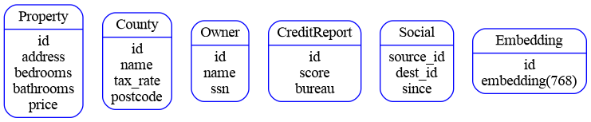
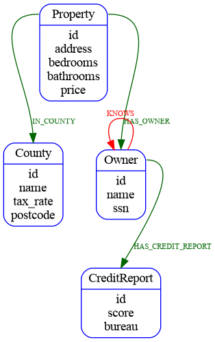

#  Real Estate Property Graph

## Buiding a Real Estate Property Graph with Google Cloud Spanner




## Prerequisites

- [Google Cloud SDK](https://cloud.google.com/sdk)
- Python 3 or greater and Python PIP 
- enable the Google Cloud SDK default login with `gcloud auth application-default login`

## Create the Spanner Instance

```bash
gcloud auth application-default login
gcloud spanner instances create properties --description="Property Graph Database" --nodes=1 --config=regional-us-west1
```

## Setup Python environment

```bash
python -m venv .venv
source .venv/bin/activate
pip install -r requirements.txt 
```

## Generate your Property Graph DDL

```bash
export gcp_project_id="YOUR_PROJECT_ID"
python ./generate_ddl.py
```

## Create the database with the necessary DDL

```bash

gcloud spanner databases create propertydb --instance  properties --ddl-file=PropertyGraphDDL.sql

```

## Load some sample data into the database

```bash
export gcp_project_id="YOUR_PROJECT_ID"
python ./generate_data.py
```

## Check out some of the queries you can run

[Queries](./SampleQueries.md)
