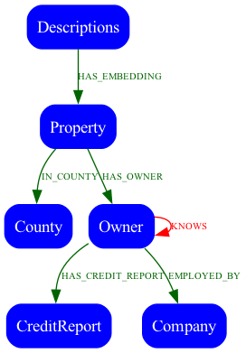

#  Property Graph

## Buiding a Property Graph with Google Cloud Spanner




## Create the Spanner Instance

```bash

gcloud spanner instances create properties --description="Property Graph Database" --nodes=1 --config=regional-us-central1

```

## Create the database with the necessary DDL

```bash

gcloud spanner databases create propertydb --instance  properties --ddl-file=PropertyGraphDDL.sql

```

## Setup Python environment

```bash
python -m venv .venv
source .venv/bin/activate
pip install -r requirements.txt 
```

## Generate the CSV Datafiles

```bash
python ./generate_data.py
```

## Check out some of the queries you can run

[Queries](./SampleQueries.md)
