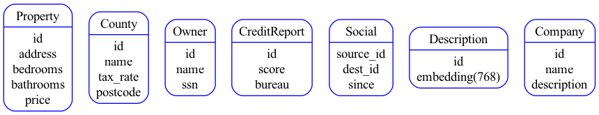

# Real Estate Property Graph

## Buiding a Real Estate Property Graph with Google Cloud Spanner

We are building the following tables of data about real estate properties, proerty owners, credit reports, and companies.



The data is related to one another through the following graph relationships


It is possible to combine [Vector search](https://cloud.google.com/blog/products/databases/how-spanner-vector-search-supports-generative-ai-apps), [Full Text Search](https://cloud.google.com/spanner/docs/full-text-search) and [Graph](https://cloud.google.com/spanner/docs/graph/overview) queries to get the most relevant results all from a single SQL compatable database that scales globally

## Prerequisites

- [Google Cloud SDK](https://cloud.google.com/sdk)
- Python 3 or greater and Python PIP 
- [Working Google Cloud CLI](https://cloud.google.com/sdk/docs/install-sdk)
- A Google Cloud project
- make

## Create the Spanner Instance

```bash
gcloud auth application-default login
make instancecreate
```

## Setup Python environment

```bash
python -m venv .venv
source .venv/bin/activate
pip install -r requirements.txt 
```

## Generate your Property Graph DDL

```bash
export gcp_project_id="YOUR_PROJECT_ID"
make genschema
```

## Create the database with the necessary DDL

```bash
make loadschema
```

## Load some sample data into the database

```bash
python ./generate_data.py
```

## Check out some of the queries you can run

[Queries](./SampleQueries.md)
